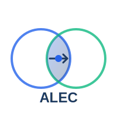

# ALEC — Adaptive Lazy Evolving Compression

<p align="center">
  
</p>

<p align="center">
  <a href="https://github.com/zeekmartin/alec-codec/actions/workflows/ci.yml"></a>
  <a href="LICENSE"></a>
  <a href="https://crates.io/crates/alec"></a>
</p>

<p align="center">
  <strong>Un codec de compression intelligent pour les environnements contraints</strong>
</p>

<p align="center">
  <a href="#caractéristiques">Caractéristiques</a> •
  <a href="#cas-dusage">Cas d'usage</a> •
  <a href="#démarrage-rapide">Démarrage rapide</a> •
  <a href="#documentation">Documentation</a> •
  <a href="#contribuer">Contribuer</a>
</p>

---

## Pourquoi ALEC ?

Dans de nombreux environnements, **chaque bit compte** :
- 🛰️ Communications spatiales à quelques kbps
- 🌿 Capteurs IoT sur batterie pendant des années
- 🌍 Zones rurales avec connectivité satellite limitée
- 🌊 Liaisons acoustiques sous-marines
- 🏭 Réseaux industriels à bande passante restreinte

ALEC répond à ces défis avec une approche innovante : **ne transmettre que ce qui a de la valeur**.

---

## Caractéristiques

### 🦥 Compression Paresseuse (Lazy)

ALEC ne transmet pas toutes les données — il transmet d'abord **la décision**, puis les détails seulement si nécessaire.

```
Sans ALEC:  [Données complètes] ───────────────────▶ 1000 octets
Avec ALEC:  [Alerte: anomalie détectée] ───────────▶ 12 octets
            [Détails sur demande] ─────────────────▶ 500 octets (si demandé)
```

### 🔄 Contexte Évolutif (Evolving)

Émetteur et récepteur construisent un **dictionnaire partagé** qui s'enrichit avec le temps.

```
Semaine 1:  "température=22.3°C" ──────────────────▶ 20 octets
Semaine 4:  [code_7][+0.3] ────────────────────────▶ 3 octets
```

### ⚖️ Asymétrie Intelligente

L'effort de calcul est placé **là où les ressources existent**.

| Mode | Émetteur | Récepteur | Usage |
|------|----------|-----------|-------|
| Standard | Léger | Lourd | Capteurs IoT, drones |
| Inversé | Lourd | Léger | Diffusion broadcast |

### 📊 Classification par Priorité

Chaque donnée reçoit une priorité qui détermine son traitement :

| Priorité | Comportement | Exemple |
|----------|--------------|---------|
| P1 CRITIQUE | Envoi immédiat + accusé | Alerte incendie |
| P2 IMPORTANT | Envoi immédiat | Anomalie détectée |
| P3 NORMAL | Envoi standard | Mesure périodique |
| P4 DIFFÉRÉ | Sur demande uniquement | Historique détaillé |
| P5 JETABLE | Jamais envoyé | Logs de debug |

---

## Cas d'usage

### 🚜 Agriculture connectée

Des capteurs dans les champs surveillent humidité, température et nutriments. Avec ALEC, ils fonctionnent 10 ans sur batterie en ne transmettant que les alertes et anomalies.

### 🏥 Télémédecine rurale

Un échographe portable en zone isolée envoie d'abord "anomalie cardiaque suspectée" en 50 octets. Le médecin distant décide s'il a besoin de l'image complète.

### 🚛 Flottes de véhicules

500 camions remontent leur position. Après quelques semaines, le système connaît les routes habituelles et ne transmet que les écarts.

### 🛰️ Observation spatiale

Un satellite photographie la Terre. Il n'envoie que les changements significatifs par rapport aux images précédentes.

➡️ [Voir tous les cas d'usage détaillés](docs/applications.md)

---

## Démarrage rapide

### Prérequis

- Rust 1.70+ (émetteur et récepteur)
- Ou : C compiler (émetteur embarqué uniquement)

### Installation

```bash
# Cloner le repo
git clone https://github.com/votre-org/alec-codec.git
cd alec-codec

# Compiler
cargo build --release

# Lancer les tests
cargo test
```

### Premier exemple

```rust
use alec::{Encoder, Decoder, Context, RawData};

fn main() {
    // Créer encodeur et décodeur avec contexte partagé
    let mut ctx_emitter = Context::new();
    let mut ctx_receiver = Context::new();
    
    let encoder = Encoder::new();
    let decoder = Decoder::new();
    
    // Simuler des mesures
    for i in 0..100 {
        let data = RawData::new(20.0 + (i as f64 * 0.1), i);
        
        // Encoder
        let message = encoder.encode(&data, &ctx_emitter);
        ctx_emitter.observe(&data);
        
        // ... transmettre message ...
        
        // Décoder
        let decoded = decoder.decode(&message, &ctx_receiver).unwrap();
        ctx_receiver.observe(&decoded);
        
        println!("Original: {:.1}, Taille: {} octets", 
                 data.value, message.len());
    }
}
```

➡️ [Guide de démarrage complet](docs/getting-started.md)

---

## Documentation

| Document | Description |
|----------|-------------|
| [Architecture](docs/architecture.md) | Vue d'ensemble technique |
| [Applications](docs/applications.md) | Cas d'usage détaillés |
| [Getting Started](docs/getting-started.md) | Guide de démarrage |
| [Protocol Reference](docs/protocol-reference.md) | Spécification du protocole |
| [Security](docs/security.md) | Considérations de sécurité |
| [API Reference](docs/intra-application.md) | Interfaces et APIs |
| [FAQ](docs/faq.md) | Questions fréquentes |
| [Glossary](docs/glossary.md) | Glossaire des termes |

---

## Performances

Résultats sur dataset de référence (capteur température, 24h, 1 mesure/min) :

| Métrique | Sans contexte | Après rodage | Objectif |
|----------|---------------|--------------|----------|
| Ratio compression | 0.65 | 0.08 | < 0.10 ✅ |
| Latence P1 | 45ms | 42ms | < 100ms ✅ |
| RAM émetteur | 12KB | 28KB | < 64KB ✅ |

---

## Roadmap

- [x] **v0.1** — Prototype fonctionnel
- [ ] **v0.2** — Contexte évolutif
- [ ] **v0.3** — Synchronisation automatique
- [ ] **v0.4** — Mode flotte
- [ ] **v1.0** — Production ready

➡️ [Voir la roadmap complète](todo.md)

---

## Contribuer

Les contributions sont les bienvenues ! Consultez :

- [CONTRIBUTING.md](CONTRIBUTING.md) — Guide de contribution
- [prompts/](prompts/) — Templates pour features, bugfixes, etc.
- [examples/](examples/) — Exemples de workflows

```bash
# Workflow typique
1. Fork le repo
2. Créer une branche: git checkout -b feature/ma-feature
3. Suivre le template approprié dans prompts/
4. Soumettre une PR
```

---

## Licence

Ce projet est sous licence MIT. Voir [LICENSE](LICENSE) pour plus de détails.

---

## Remerciements

ALEC s'inspire des travaux sur :
- Les codes correcteurs de la NASA (turbo codes, LDPC)
- La compression par dictionnaire (LZ77, LZ78)
- Les protocoles IoT efficients (CoAP, MQTT-SN)

---

<p align="center">
  <sub>Fait avec ❤️ pour un monde où chaque bit compte</sub>
</p>
