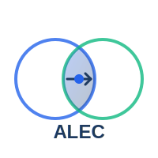

# ALEC — Adaptive Lazy Evolving Compression

<p align="center">
  
</p>

<p align="center">
  <a href="https://github.com/zeekmartin/alec-codec/actions/workflows/ci.yml"></a>
  <a href="LICENSE"></a>
  <a href="https://crates.io/crates/alec"></a>
</p>

<p align="center">
  <strong>Un codec de compression intelligent pour les environnements contraints</strong>
</p>

<p align="center">
  <a href="#caractéristiques">Caractéristiques</a> •
  <a href="#cas-dusage">Cas d'usage</a> •
  <a href="#démarrage-rapide">Démarrage rapide</a> •
  <a href="#embarqué--nostd">Embarqué / no_std</a> •
  <a href="#documentation">Documentation</a> •
  <a href="#contribuer">Contribuer</a>
</p>

---

## Pourquoi ALEC ?

Dans de nombreux environnements, **chaque bit compte** :
- 🛰️ Communications spatiales à quelques kbps
- 🌿 Capteurs IoT sur batterie pendant des années
- 🌍 Zones rurales avec connectivité satellite limitée
- 🌊 Liaisons acoustiques sous-marines
- 🏭 Réseaux industriels à bande passante restreinte

ALEC répond à ces défis avec une approche innovante : **ne transmettre que ce qui a de la valeur**.

---

## Caractéristiques

### 🦥 Compression Paresseuse (Lazy)

ALEC ne transmet pas toutes les données — il transmet d'abord **la décision**, puis les détails seulement si nécessaire.

```
Sans ALEC:  [Données complètes] ───────────────────▶ 1000 octets
Avec ALEC:  [Alerte: anomalie détectée] ───────────▶ 12 octets
            [Détails sur demande] ─────────────────▶ 500 octets (si demandé)
```

### 🔄 Contexte Évolutif (Evolving)

Émetteur et récepteur construisent un **dictionnaire partagé** qui s'enrichit avec le temps.

```
Semaine 1:  "température=22.3°C" ──────────────────▶ 20 octets
Semaine 4:  [code_7][+0.3] ────────────────────────▶ 3 octets
```

### ⚖️ Asymétrie Intelligente

L'effort de calcul est placé **là où les ressources existent**.

| Mode | Émetteur | Récepteur | Usage |
|------|----------|-----------|-------|
| Standard | Léger | Lourd | Capteurs IoT, drones |
| Inversé | Lourd | Léger | Diffusion broadcast |

### 📊 Classification par Priorité

Chaque donnée reçoit une priorité qui détermine son traitement :

| Priorité | Comportement | Exemple |
|----------|--------------|---------|
| P1 CRITIQUE | Envoi immédiat + accusé | Alerte incendie |
| P2 IMPORTANT | Envoi immédiat | Anomalie détectée |
| P3 NORMAL | Envoi standard | Mesure périodique |
| P4 DIFFÉRÉ | Sur demande uniquement | Historique détaillé |
| P5 JETABLE | Jamais envoyé | Logs de debug |

---

## Cas d'usage

### 🚜 Agriculture connectée

Des capteurs dans les champs surveillent humidité, température et nutriments. Avec ALEC, ils fonctionnent 10 ans sur batterie en ne transmettant que les alertes et anomalies.

### 🏥 Télémédecine rurale

Un échographe portable en zone isolée envoie d'abord "anomalie cardiaque suspectée" en 50 octets. Le médecin distant décide s'il a besoin de l'image complète.

### 🚛 Flottes de véhicules

500 camions remontent leur position. Après quelques semaines, le système connaît les routes habituelles et ne transmet que les écarts.

### 🛰️ Observation spatiale

Un satellite photographie la Terre. Il n'envoie que les changements significatifs par rapport aux images précédentes.

➡️ [Voir tous les cas d'usage détaillés](docs/applications.md)

---

## Écosystème

ALEC est composé de plusieurs crates :

| Crate | Description | Features |
|-------|-------------|----------|
| `alec` | Codec de compression core | Encoder, Decoder, Context |
| `alec-ffi` | Bindings C/C++ | Interface FFI, cibles embarquées |
| `alec-gateway` | Orchestration multi-capteurs | Gestion des canaux, agrégation |
| `alec-gateway[metrics]` | Observabilité entropique | TC, H_joint, Résilience R |
| `alec-complexity` | Détection d'anomalies | Baseline, Z-scores, Événements |

### Installation rapide

```toml
# Codec core uniquement
[dependencies]
alec = "1.2"

# FFI C (std)
[dependencies]
alec-ffi = "1.2"

# FFI C pour embarqué (bare-metal, sans RTOS)
[dependencies]
alec-ffi = { version = "1.2", default-features = false, features = ["bare-metal"] }

# FFI C pour Zephyr RTOS
[dependencies]
alec-ffi = { version = "1.2", default-features = false, features = ["zephyr"] }
```

---

## Démarrage rapide

### Prérequis

- Rust 1.70+ (émetteur et récepteur)
- Ou : compilateur C (émetteur embarqué uniquement via `alec-ffi`)

### Installation

```bash
git clone https://github.com/zeekmartin/alec-codec.git
cd alec-codec
cargo build --release
cargo test
```

### Premier exemple

```rust
use alec::{Encoder, Decoder, Context, RawData};

fn main() {
    let mut ctx_emitter = Context::new();
    let mut ctx_receiver = Context::new();

    let encoder = Encoder::new();
    let decoder = Decoder::new();

    for i in 0..100 {
        let data = RawData::new(20.0 + (i as f64 * 0.1), i);

        // Encoder
        let message = encoder.encode(&data, &ctx_emitter);
        ctx_emitter.observe(&data);

        // Décoder
        let decoded = decoder.decode(&message, &ctx_receiver).unwrap();
        ctx_receiver.observe(&decoded);

        println!("Original: {:.1}, Taille: {} octets", data.value, message.len());
    }
}
```

➡️ [Guide de démarrage complet](docs/getting-started.md)

---

## Embarqué / no_std

ALEC supporte les cibles embarquées depuis la version 1.2.0. Le crate `alec-ffi` fournit des bindings C avec trois niveaux de support :

### Comparaison des features

| Feature | Allocateur | Panic handler | Cible |
|---------|------------|---------------|-------|
| `std` (défaut) | Système | Système | Linux, macOS, Windows |
| `no_std` | Fourni par l'utilisateur | Fourni par l'utilisateur | Tout embarqué |
| `bare-metal` | `embedded-alloc` (heap 8KB) | `loop {}` | Bare-metal (sans RTOS) |
| `zephyr` | Zephyr `k_malloc`/`k_free` | `loop {}` | Zephyr RTOS |

### Bare-metal (sans RTOS)

```toml
alec-ffi = { version = "1.2", default-features = false, features = ["bare-metal"] }
```

```bash
rustup target add thumbv8m.main-none-eabihf
cargo build --release --target thumbv8m.main-none-eabihf --no-default-features --features bare-metal
```

### Zephyr RTOS

```toml
alec-ffi = { version = "1.2", default-features = false, features = ["zephyr"] }
```

```bash
rustup target add thumbv8m.main-none-eabi
cargo build --release --target thumbv8m.main-none-eabi --no-default-features --features zephyr
```

> **Note sur la sélection de cible pour Zephyr :** Utiliser `thumbv8m.main-none-eabi` (pas `eabihf`). La toolchain Zephyr pour nRF91 compile en mode `nofp` — utiliser la variante `hf` provoque une incompatibilité ABI au link.

### Intégration CMakeLists.txt (Zephyr)

```cmake
add_library(alec_ffi STATIC IMPORTED GLOBAL)
set_target_properties(alec_ffi PROPERTIES
    IMPORTED_LOCATION ${CMAKE_CURRENT_SOURCE_DIR}/libalec_ffi.a
)
target_include_directories(alec_ffi INTERFACE
    ${CMAKE_CURRENT_SOURCE_DIR}/include
)
# Ne pas utiliser --whole-archive — provoque une initialisation statique prématurée
# avant que le heap Zephyr soit disponible
```

Ajouter un `critical_section.c` à l'application Zephyr :

```c
#include <zephyr/kernel.h>

static unsigned int cs_irq_key;

void _critical_section_1_0_acquire(void) { cs_irq_key = irq_lock(); }
void _critical_section_1_0_release(void) { irq_unlock(cs_irq_key); }
```

### Plateformes embarquées validées

| Plateforme | SoC | Feature | Statut |
|------------|-----|---------|--------|
| Nordic nRF9151 SMA-DK | Cortex-M33 | `zephyr` | ✅ Validé |
| Cortex-M33 générique | thumbv8m | `bare-metal` | ✅ Compile |

➡️ [Voir le démo NB-IoT complet](https://github.com/zeekmartin/alec-nrf9151-demo)

---

## Documentation

| Document | Description |
|----------|-------------|
| [Architecture](docs/ARCHITECTURE.md) | Vue d'ensemble technique |
| [Getting Started](docs/getting-started.md) | Guide de démarrage |
| [Protocol Reference](docs/protocol-reference.md) | Spécification du protocole |
| [Security](docs/security.md) | Considérations de sécurité |
| [FAQ](docs/FAQ.md) | Questions fréquentes |
| [Applications](docs/applications.md) | Cas d'usage détaillés |

---

## Performances

Résultats sur dataset de référence (capteur température, 24h, 1 mesure/min) :

| Métrique | Sans contexte | Après rodage | Objectif |
|----------|---------------|--------------|----------|
| Ratio compression | 0.65 | 0.08 | < 0.10 ✅ |
| Latence P1 | 45ms | 42ms | < 100ms ✅ |
| RAM émetteur | 12KB | 28KB | < 64KB ✅ |

---

## Roadmap

- [x] **v1.0** — Production ready ✅
- [x] **v1.2.0** — Support no_std ✅
- [x] **v1.2.1** — Embarqué bare-metal (Cortex-M) ✅
- [x] **v1.2.3** — Support Zephyr RTOS ✅
- [ ] **v1.3** — Support RIOT OS
- [ ] **v1.4** — Support FreeRTOS

➡️ [Voir la roadmap complète](todo.md)

---

## Contribuer

Les contributions sont les bienvenues ! Consultez :

- [CONTRIBUTING.md](CONTRIBUTING.md) — Guide de contribution
- [prompts/](prompts/) — Templates pour features, bugfixes, etc.
- [examples/](examples/) — Exemples de workflows

---

## License

ALEC est **dual-licensed** :

### Open Source (AGPL-3.0)

Gratuit pour les projets open source, la recherche et l'usage personnel.

```toml
[dependencies]
alec = "1.2"
```

### Licence Commerciale

Pour un usage propriétaire sans obligations open-source.
À partir de $500/an pour les startups.

👉 **[Obtenir une licence commerciale](https://alec-codec.com/pricing)**

---

## Remerciements

ALEC s'inspire des travaux sur :
- Les codes correcteurs de la NASA (turbo codes, LDPC)
- La compression par dictionnaire (LZ77, LZ78)
- Les protocoles IoT efficients (CoAP, MQTT-SN)

---

<p align="center">
  <sub>Fait avec ❤️ pour un monde où chaque bit compte</sub>
</p>
